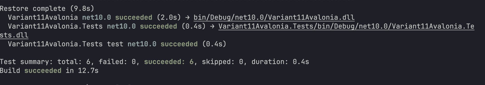

# Практическая работа 6.2 — Автоматизированные unit-тесты для Variant11Avalonia

Учебный проект: десктопное приложение `Variant11Avalonia` из ПР №4 и проект модульного тестирования `Variant11Avalonia.Tests` для автоматической проверки трех математических функций.  
Цель работы: провести тестирование программных модулей методом белого ящика с использованием автоматизированных unit-тестов в Microsoft Visual Studio.

## Дисциплина
`Тестирование программного обеспечения`

## Сведения о работе
- Практическая работа: `№4`
- Вариант: `11`
- Разработчик: `Кобелев Д.`
- Учебная группа: `3ИСИП-423`

## Сведения о тестировании
- Практическая работа: `№6, часть 2`
- Тестируемый проект: `Variant11Avalonia`
- Тестовый проект: `Variant11Avalonia.Tests`
- Подход: `white-box testing`

## Функциональные возможности
- Страница 1: ввод `x, y, z`, расчет `b`, вывод результата, кнопки `Вычислить`/`Очистить`.
- Страница 2: ввод `x, y`, выбор функции `f(x)` (`sh(x)`, `x^2`, `e^x`), расчет `a` по веткам, вывод результата и активной ветки.
- Страница 3: ввод `x0, xk, dx, a, b`, табулирование функции `y`, вывод таблицы и построение графика.
- Общие функции: навигация по вкладкам, `ToolTip` на элементах UI, подтверждение закрытия приложения.

## Что протестировано
- Тренировочный тест `TestMethod1()` с базовыми проверками `Assert`.
- Функция `ComputePage1(x, y, z)` для вычисления значения `b`.
- Функция `ComputePage2(x, y, function, out branch)` для вычисления значения `a`.
- Функция `ComputePage3Y(x, a, b)` для вычисления табличного значения `y`.
- Все три ветки условия во второй функции: `xy > 0`, `xy < 0`, `xy = 0`.

## Что делают методы Assert
- `Assert.AreEqual` сравнивает ожидаемое и фактическое значения.
- `Assert.AreNotEqual` проверяет, что значения не совпадают.
- `Assert.IsTrue` подтверждает истинность условия.
- `Assert.IsFalse` подтверждает ложность условия.
- `Assert.IsNull` проверяет, что объект равен `null`.
- `Assert.IsNotNull` проверяет, что объект создан.

## Валидация ввода
- Все поля должны содержать корректные числа.
- Для страницы 1: требуется `x + y > 0` (из-за `sqrt(x+y)`).
- Для страницы 3: `dx != 0`.
- Для страницы 3: знак шага должен соответствовать направлению диапазона.
- Для страницы 3: ограничение на число итераций (защита от бесконечного цикла).

## Рефакторинг
- Вычисления второй страницы переведены на вызов `CalculationEngine.ComputePage2(...)` вместо дублирования формулы в UI.
- Вычисления третьей страницы переведены на вызов `CalculationEngine.ComputePage3Y(...)` вместо локального дублирующего метода.
- Для `CalculationEngine` и `Page2Function` добавлены XML-комментарии.
- В файле проекта включена генерация XML-документации через `GenerateDocumentationFile`.

## Скриншоты формул
Формула страницы 1 (`b`):  


Формула страницы 2 (`a`):  


Формула страницы 3 (`y`):  


## Технологии
- `C#`
- `.NET 10`
- `Avalonia UI 11`
- `MSTest`

## Структура проекта
```text
Variant11Avalonia/
├─ Variant11Avalonia.sln
├─ Assets/
│  ├─ 1.png
│  ├─ 2.png
│  └─ 3.png
├─ Variant11Avalonia.Tests/
│  ├─ Variant11Avalonia.Tests.csproj
│  └─ CalculationEngineTests.cs
├─ Controls/
│  └─ FunctionChartControl.cs
├─ App.axaml
├─ App.axaml.cs
├─ MainWindow.axaml
├─ MainWindow.axaml.cs
├─ Program.cs
├─ CalculationEngine.cs
├─ Variant11Avalonia.csproj
└─ README.md
```

## Архитектура приложения
- Тип приложения: `Desktop` на `Avalonia UI` c одним главным окном.
- Навигация: `TabControl` с 3 страницами (расчет `b`, расчет `a`, табулирование/график `y`).
- Слой вычислений: `CalculationEngine.cs` (чистые методы для математических формул).
- Слой UI: `MainWindow.axaml` + `MainWindow.axaml.cs` (обработка ввода, валидация, вывод результатов).
- Слой тестирования: `Variant11Avalonia.Tests/CalculationEngineTests.cs`.
- График: `Controls/FunctionChartControl.cs` (отрисовка точек табулирования).
- Ресурсы формул: `Assets/1.png`, `Assets/2.png`, `Assets/3.png`.

## Сборка и запуск
```bash
dotnet build
dotnet run
dotnet test
```

## Реализованные тестовые методы
- `TestMethod1`
- `ComputePage1_WithValidArguments_ReturnsExpectedValue`
- `ComputePage2_WhenProductIsPositive_UsesPositiveBranch`
- `ComputePage2_WhenProductIsNegative_UsesNegativeBranch`
- `ComputePage2_WhenProductIsZero_UsesZeroBranch`
- `ComputePage3Y_WithValidArguments_ReturnsExpectedValue`

## Скриншоты результатов
- Скриншот работы приложения: добавить после запуска `Variant11Avalonia`.
- Скриншот окна `Обозреватель тестов`:



- При необходимости можно добавить строку с итогом проверки: `Passed: 6, Failed: 0`.

## Вывод
В ходе практической работы для проекта `Variant11Avalonia` был создан отдельный проект автоматизированного тестирования `Variant11Avalonia.Tests`. Тесты покрывают три математические функции из ПР №4 и проверяют как корректность численных результатов, так и выбор ветвей условия во второй формуле.

Причина успешного выполнения тестов состоит в том, что вычислительная логика вынесена в `CalculationEngine`, а тесты обращаются к тем же методам, которые использует пользовательский интерфейс. Если тесты не выполняются успешно, причиной обычно является ошибка в формуле, неверное ожидаемое значение либо проблемы со сборкой или запуском тестового окружения.
