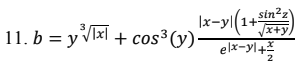
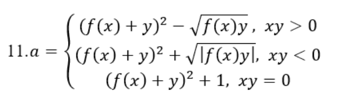
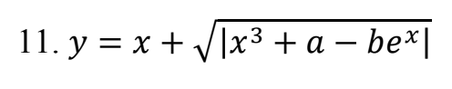

# Практическая работа 4 — Вариант 11 (Avalonia)

Учебный проект: десктопное приложение для расчета трех функций, табулирования значений и построения графика.  
Цель работы: отработка ручного тестирования методом белого ящика.

## Дисциплина
`Тестирование программного обеспечения`

## Сведения о работе
- Практическая работа: `№4`
- Вариант: `11`
- Разработчик: `Кобелев Д.`
- Учебная группа: `3ИСИП-423`

## Функциональные возможности
- Страница 1: ввод `x, y, z`, расчет `b`, вывод результата, кнопки `Вычислить`/`Очистить`.
- Страница 2: ввод `x, y`, выбор функции `f(x)` (`sh(x)`, `x^2`, `e^x`), расчет `a` по веткам, вывод результата и активной ветки.
- Страница 3: ввод `x0, xk, dx, a, b`, табулирование функции `y`, вывод таблицы и построение графика.
- Общие функции: навигация по вкладкам, `ToolTip` на элементах UI, подтверждение закрытия приложения.

## Валидация ввода
- Все поля должны содержать корректные числа.
- Для страницы 1: требуется `x + y > 0` (из-за `sqrt(x+y)`).
- Для страницы 3: `dx != 0`.
- Для страницы 3: знак шага должен соответствовать направлению диапазона.
- Для страницы 3: ограничение на число итераций (защита от бесконечного цикла).


## Скриншоты формул
Формула страницы 1 (`b`):  


Формула страницы 2 (`a`):  


Формула страницы 3 (`y`):  


## Технологии
- `C#`
- `.NET 10`
- `Avalonia UI 11`

## Структура проекта
```text
Variant11Avalonia/
├─ Assets/
│  ├─ 1.png
│  ├─ 2.png
│  └─ 3.png
├─ Controls/
│  └─ FunctionChartControl.cs
├─ App.axaml
├─ App.axaml.cs
├─ MainWindow.axaml
├─ MainWindow.axaml.cs
├─ Program.cs
├─ CalculationEngine.cs
├─ Variant11Avalonia.csproj
└─ README.md
```

## Архитектура приложения
- Тип приложения: `Desktop` на `Avalonia UI` c одним главным окном.
- Навигация: `TabControl` с 3 страницами (расчет `b`, расчет `a`, табулирование/график `y`).
- Слой вычислений: `CalculationEngine.cs` (чистые методы для математических формул).
- Слой UI: `MainWindow.axaml` + `MainWindow.axaml.cs` (обработка ввода, валидация, вывод результатов).
- График: `Controls/FunctionChartControl.cs` (отрисовка точек табулирования).
- Ресурсы формул: `Assets/1.png`, `Assets/2.png`, `Assets/3.png`.

## Сборка и запуск
```bash
dotnet build
dotnet run
```
